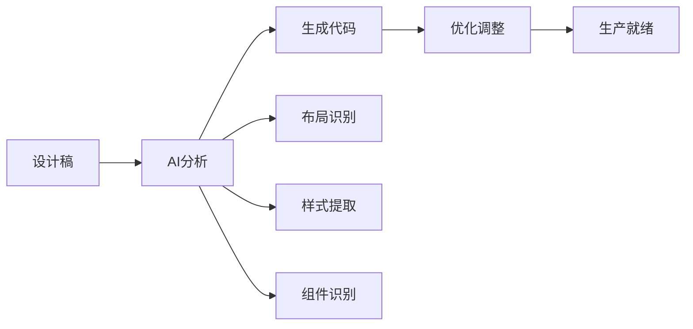

import { Callout } from 'nextra/components'

# 19. AI时代的前端开发

<Callout type="info">
AI技术正在革命性地改变前端开发方式。从ChatGPT到Cursor，从GitHub Copilot到Claude，AI工具已经成为现代前端开发者的核心生产力工具。
</Callout>

## 📋 目录

- [AI编程助手生态](#ai编程助手生态)
- [ChatGPT在前端开发中的应用](#chatgpt在前端开发中的应用)
- [Cursor AI代码编辑器](#cursor-ai代码编辑器)
- [Claude代码助手实践](#claude代码助手实践)
- [GitHub Copilot集成开发](#github-copilot集成开发)
- [AI驱动的开发工作流](#ai驱动的开发工作流)
- [AI代码质量和最佳实践](#ai代码质量和最佳实践)
- [前端AI工具链整合](#前端ai工具链整合)
- [AI时代的技能转型](#ai时代的技能转型)

## AI编程助手生态

<Callout type="info">
[AI](https://developer.mozilla.org/en-US/docs/Glossary/AI)正在深刻改变前端开发的方式，从代码生成到用户体验优化，AI技术为前端开发带来了前所未有的可能性。
</Callout>

### AI前端开发工具对比

| 应用场景 | 主要工具 | 核心功能 | 效率提升 |
|---------|---------|---------|---------|
| **代码生成** | GitHub Copilot, ChatGPT, Tabnine | 自动补全、函数生成、重构建议 | 200-300% |
| **设计转代码** | Figma to Code, Uizard, Locofy | 设计稿识别、布局生成、样式提取 | 150-200% |
| **智能测试** | Testim, Applitools, Mabl | 自动化测试、视觉回归、元素定位 | 100-150% |
| **用户体验** | 机器学习算法、推荐系统 | 个性化推荐、智能搜索、自适应界面 | 50-100% |

### AI代码生成示例

```javascript
// 提示词: "Create a responsive card component with image, title, and description"
const Card = ({ image, title, description, onClick }) => {
  return (
    <div className="max-w-sm rounded-lg shadow-lg overflow-hidden cursor-pointer hover:shadow-xl transition-shadow" 
         onClick={onClick}>
      
      <div className="p-4">
        <h3 className="text-lg font-semibold text-gray-800 mb-2">{title}</h3>
        <p className="text-gray-600 text-sm">{description}</p>
      </div>
    </div>
  );
};
```

### 设计到代码工作流



### AI开发助手功能对比

| 功能 | 用途 | 提示词示例 | 预期效果 |
|------|------|-----------|---------|
| **代码生成** | 创建新功能 | "创建一个可复用的Modal组件，支持自定义标题和内容" | 生成完整组件代码 |
| **代码审查** | 质量检查 | "请审查以下代码的性能和安全性问题" | 提供改进建议 |
| **测试生成** | 自动化测试 | "为这个函数生成Jest测试用例，包括边界条件" | 生成测试代码 |
| **代码重构** | 优化现有代码 | "重构这段代码，提高可读性和性能" | 优化后的代码 |
| **文档生成** | API文档 | "为这个类生成JSDoc文档" | 完整的文档注释 |

### 实用的AI提示词模板

**React组件生成模板**：
```
创建一个React组件，要求：
- 组件名称：[ComponentName]
- 功能描述：[具体功能]
- Props接口：[参数列表]
- 样式方案：[CSS方案]
- 状态管理：[状态管理方式]
- 可访问性：包含ARIA属性
- TypeScript：使用严格类型定义
```

**代码审查模板**：
```
请审查以下代码，重点关注：
1. 代码质量和可读性
2. 性能优化机会
3. 安全性问题
4. 最佳实践遵循
5. 潜在的bug

[粘贴代码]
```

## ChatGPT在前端开发中的应用

<Callout type="info">
ChatGPT作为最受欢迎的AI编程助手，在前端开发中有着广泛的应用场景。从代码生成到问题解决，ChatGPT已经成为开发者的得力助手。
</Callout>

### ChatGPT前端开发最佳实践

#### 常用提示词模板

| 场景 | 模板 | 使用技巧 |
|------|------|---------|
| **React组件** | "创建一个[组件名]组件，功能是[具体描述]，使用[技术栈]，包含[特殊要求]" | 明确指定技术栈和具体需求 |
| **代码优化** | "优化以下代码的[性能/可读性/安全性]，重点关注[具体问题]" | 指明优化重点和期望结果 |
| **调试帮助** | "分析这个错误：[错误信息]，代码如下：[代码]，环境：[环境信息]" | 提供完整的错误上下文 |
| **架构设计** | "设计一个[项目类型]的前端架构，要求[性能要求]，团队规模[人数]" | 说明项目规模和约束条件 |

#### 实际应用示例

**React组件生成**：
```
请创建一个SearchInput组件，要求如下：
- 功能：带搜索建议的智能输入框
- 技术栈：React + TypeScript + Tailwind CSS
- 特性：防抖搜索、键盘导航、可访问性
- 状态管理：使用useState Hook
```

**代码优化示例**：
```javascript
// 优化前的代码
function UserList({ users }) {
  const [filteredUsers, setFilteredUsers] = useState([]);
  
  useEffect(() => {
    const filtered = users.filter(user => user.active);
    setFilteredUsers(filtered);
  }, [users]);

  return (
    <div>
      {filteredUsers.map(user => (
        <div key={user.id}>
          <h3>{user.name}</h3>
          <p>{user.email}</p>
        </div>
      ))}
    </div>
  );
}

// ChatGPT优化后的代码
const UserList = memo(({ users }) => {
  const filteredUsers = useMemo(
    () => users?.filter(user => user.active) || [],
    [users]
  );

  if (!filteredUsers.length) {
    return <div>暂无活跃用户</div>;
  }

  return (
    <div className="user-list">
      {filteredUsers.map(user => (
        <UserCard key={user.id} user={user} />
      ))}
    </div>
  );
});
```

#### ChatGPT使用技巧

**提示词优化原则**：
1. **具体明确**：详细描述需求和约束条件
2. **提供上下文**：说明项目背景和技术栈
3. **分步骤**：复杂任务分解为多个步骤
4. **包含示例**：提供期望的输出格式

**常见问题解决**：

| 问题类型 | 解决方案 | 示例提示词 |
|---------|---------|-----------|
| **调试错误** | 提供完整错误信息和代码上下文 | "React错误：Cannot read property 'map' of undefined，代码：[代码]，环境：React 18" |
| **性能优化** | 明确性能目标和当前瓶颈 | "优化这个组件的渲染性能，目标是减少50%的重渲染" |
| **架构设计** | 说明项目规模和技术约束 | "设计电商后台架构，50+页面，8人团队，React技术栈" |

## Cursor AI代码编辑器

<Callout type="warning">
Cursor是2024年最受关注的AI代码编辑器，基于Claude 3.5 Sonnet和GPT-4，提供了前所未有的代码库级别的AI辅助开发体验。
</Callout>

### Cursor核心功能

#### 功能对比表

| 功能 | 描述 | 快捷键 | 使用场景 |
|------|------|--------|---------|
| **代码库对话** | 与整个项目进行AI对话 | `Cmd+K` | 架构分析、跨文件重构 |
| **智能补全** | 基于上下文的代码预测 | `Tab` | 函数实现、类型定义 |
| **实时编辑** | 选中代码直接AI编辑 | `Cmd+L` | 代码优化、风格统一 |
| **内联建议** | 行内AI建议和修复 | `Cmd+I` | 快速修复、性能优化 |
| **多文件编辑** | 批量修改多个文件 | `Cmd+Shift+L` | 大规模重构 |

#### 实用对话示例

**项目分析**：
```
"分析这个React项目的组件架构，找出可以优化的地方"
"检查所有使用useState的组件，是否有性能问题"
"找到项目中所有的API调用，统一错误处理方式"
```

**代码重构**：
```
"将这个类组件重构为函数组件，保持功能不变"
"优化这个组件的性能，减少不必要的重渲染"
"为这些函数添加TypeScript类型定义"
```

#### Cursor快捷键速查

| 快捷键 | 功能 | 使用技巧 |
|--------|------|---------|
| `Cmd+K` | 打开AI对话 | 用于复杂问题和项目级分析 |
| `Cmd+L` | 选择代码编辑 | 选中代码后直接描述需求 |
| `Cmd+I` | 内联建议 | 光标位置获取快速建议 |
| `Tab` | 接受建议 | 接受AI生成的代码补全 |
| `Esc` | 取消建议 | 拒绝当前AI建议 |

#### Cursor工作流程

**项目初始化流程**：
1. **项目分析** → "分析这个项目的架构和技术栈"
2. **代码规范** → "检查并统一代码风格"
3. **依赖检查** → "分析package.json，检查过时依赖"
4. **性能基线** → "识别性能瓶颈，制定优化方案"

**功能开发流程**：
1. **需求分析** → "分析[功能]的技术方案和架构设计"
2. **代码实现** → "基于设计实现[功能]的完整代码"
3. **测试编写** → "为[功能]生成完整的测试用例"
4. **文档编写** → "编写[功能]的使用文档和API说明"

**代码重构流程**：
1. **重构分析** → "分析[组件]的重构机会和风险"
2. **重构计划** → "制定详细的重构步骤和策略"
3. **执行重构** → "执行重构，保持功能不变"
4. **验证结果** → "验证重构效果和代码质量"

#### Cursor提示词优化技巧

**提供充分上下文**：
```
✅ 好的提示词：
"在这个React电商项目中，我需要创建一个产品搜索组件。
项目使用TypeScript、Tailwind CSS和React Query。
组件需要支持实时搜索、筛选和分页功能。
请参考现有的ProductCard组件的设计风格。"

❌ 不好的提示词：
"创建一个搜索组件"
```

**具体明确的要求**：
```
✅ 好的提示词：
"重构UserProfile组件，要求：
1. 将类组件改为函数组件
2. 使用TypeScript严格模式
3. 添加loading和error状态
4. 实现数据缓存机制
5. 保持现有的API接口不变"

❌ 不好的提示词：
"优化这个组件"
```

#### Cursor生产力技巧

| 技巧 | 说明 | 使用场景 |
|------|------|---------|
| **@符号引用** | 引用特定文件或函数 | 跨文件分析和重构 |
| **代码库搜索** | 快速定位相关代码 | 理解项目结构 |
| **AI生成commit** | 自动生成提交信息 | 版本控制管理 |
| **代码解释** | 理解复杂逻辑 | 学习和维护 |
| **AI代码审查** | 自动化代码检查 | 质量保证 |

## Claude代码助手实践

<Callout type="info">
Claude 3.5 Sonnet在代码质量和推理能力方面表现卓越，特别适合复杂逻辑实现、代码审查和架构设计。
</Callout>

### Claude在前端开发中的优势

#### Claude vs 其他AI工具对比

| 特性 | Claude 3.5 | ChatGPT | GitHub Copilot | 优势说明 |
|------|------------|---------|----------------|----------|
| **代码质量** | ⭐⭐⭐⭐⭐ | ⭐⭐⭐⭐ | ⭐⭐⭐ | 生成代码几乎无bug，严格遵循最佳实践 |
| **安全性** | ⭐⭐⭐⭐⭐ | ⭐⭐⭐ | ⭐⭐ | 自动识别安全漏洞，建议安全编码实践 |
| **架构思维** | ⭐⭐⭐⭐⭐ | ⭐⭐⭐⭐ | ⭐⭐ | 系统性思考，模块化设计，可扩展性考虑 |
| **错误处理** | ⭐⭐⭐⭐⭐ | ⭐⭐⭐ | ⭐⭐ | 完善的错误处理，考虑边界情况 |
| **代码补全** | ⭐⭐⭐ | ⭐⭐ | ⭐⭐⭐⭐⭐ | 实时补全方面Copilot更强 |

#### Claude代码质量示例

**完善的错误处理**：
```typescript
// Claude生成的代码通常包含完善的错误处理
const fetchUserData = async (userId: string): Promise<User | null> => {
  try {
    if (!userId || typeof userId !== 'string') {
      throw new Error('Invalid user ID provided');
    }

    const response = await fetch(`/api/users/${userId}`);

    if (!response.ok) {
      if (response.status === 404) {
        return null; // User not found
      }
      throw new Error(`HTTP ${response.status}: ${response.statusText}`);
    }

    const userData = await response.json();
    return validateUserData(userData) ? userData : null;
  } catch (error) {
    console.error('Failed to fetch user data:', error);
    throw error;
  }
};
```

**安全性考虑**：
```typescript
// Claude会自动添加安全性考虑
const sanitizeInput = (input: string): string => {
  return input
    .replace(/[<>]/g, '') // 移除潜在的HTML标签
    .trim()
    .slice(0, 1000); // 限制长度
};

const handleUserInput = (userInput: string) => {
  const sanitized = sanitizeInput(userInput);
  // 进一步处理...
};
```

#### Claude擅长的设计模式

Claude在架构设计方面表现出色，常用的设计模式包括：

- **Factory Pattern** - 对象创建模式
- **Observer Pattern** - 事件监听模式
- **Strategy Pattern** - 策略选择模式
- **Command Pattern** - 命令执行模式

#### Claude实用提示词模板

**状态管理设计**：
```
设计一个前端状态管理方案，项目要求：
- 项目类型：[电商/管理后台/社交应用]
- 数据复杂度：[简单/中等/复杂]
- 用户交互：[基础/丰富/实时]
- 性能要求：[标准/高性能/极致优化]
- 团队规模：[个人/小团队/大团队]

请提供：架构设计、数据流、状态策略、性能方案、类型定义、测试策略
```

**性能优化分析**：
```
分析以下前端代码的性能问题：
[粘贴代码]

请从以下角度分析：
1. 渲染性能 2. 内存使用 3. 网络优化
4. 代码分割 5. 缓存策略 6. 用户体验

并提供具体的优化建议和实现方案。
```

**安全审计**：
```
对以下前端代码进行安全审计：
[粘贴代码]

检查项目：XSS漏洞、CSRF防护、输入验证、数据泄露、依赖安全、认证授权
请提供详细的安全报告和修复建议。
```

## GitHub Copilot集成开发

<Callout type="info">
GitHub Copilot作为最成熟的AI编程助手，在IDE集成和团队协作方面具有显著优势，是企业级开发的首选工具。
</Callout>

### GitHub Copilot最佳实践

#### 代码补全优化技巧

| 技巧 | 说明 | 示例 |
|------|------|------|
| **清晰命名** | 使用描述性的函数名和变量名 | `validateEmailFormat` vs `check` |
| **有意义注释** | 添加注释作为AI提示 | `// 验证用户邮箱地址格式` |
| **保持上下文** | 维护代码上下文的一致性 | 相关函数放在一起 |
| **TypeScript类型** | 使用类型提供更好的提示 | 明确的接口定义 |

#### 团队协作配置

**组织级别设置**：
- 启用组织范围的Copilot
- 配置用户权限和访问控制
- 设置代码建议过滤规则
- 启用审计日志记录

**代码质量保证**：
- 定期审查AI生成的代码
- 建立代码质量检查流程
- 培训团队成员正确使用
- 监控代码安全性

#### Copilot开发模式

**注释驱动开发**：
```javascript
// 创建一个React Hook用于管理购物车状态
// 包含添加商品、删除商品、更新数量、计算总价等功能
// 使用localStorage持久化数据
const useShoppingCart = () => {
  // Copilot会自动生成完整的Hook实现
};
```

**测试驱动开发**：
```javascript
// 先写测试用例，Copilot会根据测试生成实现
describe('UserService', () => {
  it('should validate user email format', () => {
    expect(UserService.validateEmail('test@example.com')).toBe(true);
    expect(UserService.validateEmail('invalid-email')).toBe(false);
  });
});

// Copilot会根据测试用例生成UserService的实现
```

**类型驱动开发**：
```typescript
// 先定义TypeScript接口，Copilot会生成符合类型的实现
interface UserRepository {
  findById(id: string): Promise<User | null>;
  create(userData: Omit<User, 'id' | 'createdAt' | 'updatedAt'>): Promise<User>;
  update(id: string, userData: Partial<User>): Promise<User>;
  delete(id: string): Promise<void>;
}

// Copilot会生成符合接口的实现
class DatabaseUserRepository implements UserRepository {
  // 实现会自动生成
}
```

## AI驱动的开发工作流

<Callout type="warning">
AI工具的真正价值在于如何将它们整合到完整的开发工作流中，提升整个团队的生产力和代码质量。
</Callout>

### 现代AI开发工作流

#### AI工具链整合策略

| 阶段 | 主要工具 | 核心任务 | 预期产出 |
|------|---------|---------|---------|
| **需求分析** | ChatGPT, Claude | 需求分析、技术方案设计 | 详细的开发计划 |
| **代码开发** | Cursor, GitHub Copilot | 代码生成、实时补全 | 高质量代码实现 |
| **代码审查** | Claude, AI Code Review | 代码质量检查、安全审计 | 优化建议和修复方案 |
| **测试编写** | GitHub Copilot, AI Testing | 测试用例生成、自动化测试 | 完整的测试覆盖 |
| **部署监控** | AI-powered CI/CD | 自动化部署、性能监控 | 稳定的生产环境 |

#### 开发效率指标

**速度提升**：
- 代码生成速度：200-300%提升
- Bug修复时间：75%减少
- 功能交付时间：60%缩短

**质量改善**：
- Bug密度：47%降低
- 代码审查时间：75%减少
- 测试覆盖率：31%提升

#### 团队协作规范

**AI使用指南**：
1. 始终审查AI生成的代码
2. 在提交信息中标注AI工具使用
3. 分享有效的提示词模板
4. 定期进行AI工具培训

**质量控制**：
1. AI代码必须通过人工审查
2. 对AI生成代码进行安全扫描
3. 要求性能测试验证
4. 确保文档完整性

## AI代码质量和最佳实践

<Callout type="warning">
使用AI工具生成代码时，确保代码质量和遵循最佳实践至关重要。需要建立完善的审查和验证机制。
</Callout>

### AI代码质量检查

#### 安全性检查清单

| 检查项 | 风险等级 | 检查方法 | 修复建议 |
|--------|----------|----------|----------|
| **XSS漏洞** | 高 | 检查innerHTML使用 | 使用DOMPurify清理 |
| **SQL注入** | 严重 | 检查字符串拼接查询 | 使用参数化查询 |
| **硬编码密钥** | 严重 | 扫描敏感信息 | 使用环境变量 |
| **不安全的eval** | 高 | 检查eval()使用 | 避免使用eval |

#### 性能质量检查

**常见性能问题**：
- 循环中的DOM查询
- 未移除的事件监听器
- 不必要的重渲染
- 内存泄漏风险

#### 可维护性检查

**代码质量标准**：
- 函数长度不超过50行
- 嵌套层级不超过6层
- 避免魔法数字
- 使用描述性命名

#### 代码审查清单

**功能性检查**：
- [ ] 功能是否符合需求
- [ ] 边界情况是否处理
- [ ] 错误处理是否完善
- [ ] 性能是否满足要求

**安全性检查**：
- [ ] 输入验证是否充分
- [ ] 是否存在安全漏洞
- [ ] 敏感信息是否保护
- [ ] 权限控制是否正确

**可维护性检查**：
- [ ] 代码结构是否清晰
- [ ] 命名是否有意义
- [ ] 注释是否充分
- [ ] 是否遵循团队规范

## 前端AI工具链整合

<Callout type="info">
成功的AI驱动开发需要将多个AI工具有机整合，形成完整的工具链，覆盖从设计到部署的全流程。
</Callout>

### 完整AI工具链架构

#### 工具链组成

| 环节 | 推荐工具 | 主要功能 | 集成方式 |
|------|---------|---------|---------|
| **设计** | Figma AI, Uizard | 设计稿转代码 | API集成 |
| **开发** | Cursor, GitHub Copilot | 代码生成和补全 | IDE插件 |
| **测试** | Testim, Applitools | 自动化测试 | CI/CD集成 |
| **审查** | Claude, DeepCode | 代码质量检查 | Git Hooks |
| **部署** | Vercel AI, Netlify | 智能部署优化 | 平台集成 |
| **监控** | LogRocket AI, Sentry | 智能错误分析 | SDK集成 |

#### 数据流管理

**工具间数据传递**：
1. **设计到开发**：设计令牌 → 代码生成
2. **开发到测试**：代码上下文 → 测试用例
3. **测试到部署**：质量报告 → 部署决策
4. **部署到监控**：性能数据 → 优化建议

#### 配置管理

**统一配置中心**：
```json
{
  "aiTools": {
    "cursor": {
      "model": "claude-3.5-sonnet",
      "temperature": 0.7,
      "maxTokens": 4000
    },
    "copilot": {
      "suggestions": "contextual",
      "autoComplete": true,
      "codeReview": "on-save"
    },
    "claude": {
      "reviewLevel": "strict",
      "securityFocus": true,
      "performanceAnalysis": true
    }
  }
}
```

## AI时代的技能转型

<Callout type="warning">
AI时代的前端开发者需要重新定义自己的技能组合，从纯技术执行者转向AI协作者和架构师。
</Callout>

### 前端开发者技能转型路径

#### 技能重要性变化

**重要性上升的技能**：
- AI工具使用（关键）
- 系统思维（高）
- 产品思维（高）
- 学习能力（关键）

**重要性下降的技能**：
- 重复性编码（低）
- 语法记忆（低）
- 工具链配置（中等）

**保持稳定的技能**：
- 问题解决（关键）
- 用户体验设计（高）
- 团队协作（高）

#### 学习路径规划

**初级阶段（1-3个月）**：
1. 学会使用ChatGPT进行代码学习
2. 掌握GitHub Copilot基本功能
3. 了解AI辅助调试方法

**中级阶段（3-6个月）**：
1. 掌握多AI工具协作
2. 学习AI驱动的开发流程
3. 了解AI代码质量保证

**高级阶段（6-12个月）**：
1. 掌握AI系统架构设计
2. 学习AI模型训练和部署
3. 了解AI伦理和安全

#### 职业发展方向

| 职业路径 | 薪资提升 | 市场需求 | 核心技能 |
|----------|----------|----------|----------|
| **AI增强型开发者** | +30-50% | 很高 | AI工具专家、提示词工程 |
| **AI系统架构师** | +50-80% | 高 | 系统设计、AI集成、技术决策 |
| **AI产品经理** | +40-70% | 高 | 产品思维、AI理解、用户研究 |
| **AI技术顾问** | +60-100% | 中高 | 咨询能力、AI专业知识、业务理解 |

---

<Callout type="success">
AI正在重塑前端开发的未来，从提高开发效率到创造全新的用户体验。拥抱AI技术，将让我们成为更高效、更创新的前端开发者。
</Callout>

---

## 📚 参考学习资料

### 📖 官方文档
- [OpenAI API](https://platform.openai.com/docs) - OpenAI官方API文档
- [GitHub Copilot](https://docs.github.com/en/copilot) - GitHub Copilot官方文档
- [Anthropic Claude](https://docs.anthropic.com/) - Claude AI官方文档
- [Cursor](https://cursor.sh/docs) - Cursor AI编辑器文档

### 🎯 在线教程
- [AI for Developers](https://www.deeplearning.ai/courses/) - DeepLearning.AI课程
- [Prompt Engineering Guide](https://www.promptingguide.ai/) - 提示词工程指南
- [AI-Powered Development](https://github.blog/2023-10-30-the-future-of-ai-powered-development/) - GitHub AI开发指南

### 🔧 开发工具
- [GitHub Copilot](https://github.com/features/copilot) - AI代码助手
- [Cursor](https://cursor.sh/) - AI驱动的代码编辑器
- [ChatGPT](https://chat.openai.com/) - 对话式AI助手
- [Claude](https://claude.ai/) - Anthropic AI助手

### 📝 深入阅读
- [The Future of Programming](https://github.blog/2023-10-30-the-future-of-ai-powered-development/) - AI编程的未来
- [AI in Frontend Development](https://web.dev/ai/) - Web.dev AI指南
- [Stack Overflow 2024 Developer Survey](https://survey.stackoverflow.co/2024/) - 开发者AI使用调查

<Callout type="tip">
💡 **学习建议**：建议从ChatGPT和GitHub Copilot等基础AI工具开始，逐步掌握Cursor等高级AI编辑器，最后探索AI驱动的完整开发工作流。
</Callout>
