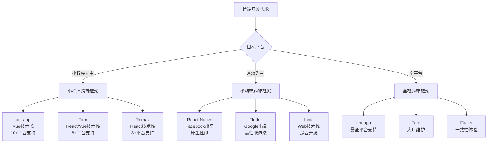
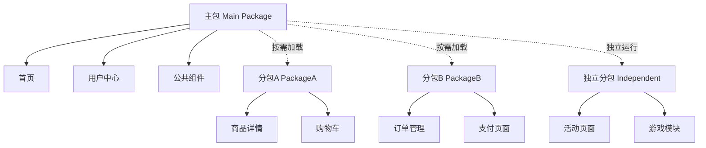
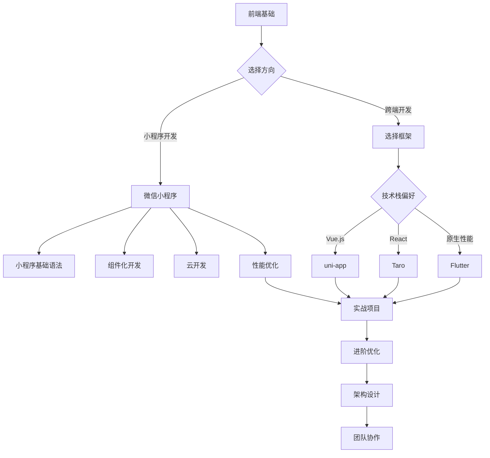

import { Callout } from 'nextra/components'

# 12. 小程序和跨端开发

## 📋 目录

- [小程序生态概览](#小程序生态概览)
- [微信小程序核心概念](#微信小程序核心概念)
- [跨端开发框架选择](#跨端开发框架选择)
- [uni-app开发实践](#uni-app开发实践)
- [Taro开发实践](#taro开发实践)
- [性能优化策略](#性能优化策略)

## 小程序生态概览

<Callout type="info">
小程序作为轻量级应用形态，在移动互联网时代扮演着重要角色。它们无需下载安装，即用即走，为用户提供了便捷的服务体验。
</Callout>

### 小程序发展历程

小程序的发展经历了几个重要阶段：

1. **2017年** - 微信小程序正式发布，开创了小程序时代
2. **2018年** - 支付宝、百度相继推出小程序平台
3. **2019年** - 字节跳动、QQ等平台加入小程序生态
4. **2020年** - 小程序生态成熟，跨端开发框架兴起
5. **2021年至今** - 小程序与原生App深度融合，生态持续完善

### 主流小程序平台特点

#### 微信小程序
- **用户基数**：12亿+活跃用户
- **核心优势**：社交分享、微信支付、云开发能力
- **技术特点**：WXML + WXSS + JavaScript
- **适用场景**：电商、工具、内容分发、轻游戏

#### 支付宝小程序
- **用户基数**：10亿+活跃用户
- **核心优势**：支付能力、芝麻信用、生活服务
- **技术特点**：AXML + ACSS + JavaScript
- **适用场景**：金融服务、生活缴费、政务服务

#### 百度智能小程序
- **用户基数**：5亿+活跃用户
- **核心优势**：SEO友好、AI能力、开放生态
- **技术特点**：Swan + CSS + JavaScript
- **适用场景**：内容资讯、工具应用、智能服务

#### 字节跳动小程序
- **用户基数**：6亿+活跃用户
- **核心优势**：抖音流量、算法推荐、短视频
- **技术特点**：TTML + TTSS + JavaScript
- **适用场景**：内容娱乐、电商直播、社交应用

### 小程序 vs 原生App 对比

| 维度 | 小程序 | 原生App |
|------|--------|---------|
| **开发成本** | 低 | 高 |
| **发布周期** | 快速 | 较慢 |
| **用户获取** | 容易（分享、搜索） | 困难（应用商店） |
| **性能表现** | 良好 | 优秀 |
| **功能限制** | 有限制 | 无限制 |
| **存储空间** | 不占用 | 占用设备空间 |
| **更新机制** | 自动更新 | 需用户主动更新 |

### 跨端开发的必要性

随着小程序平台的增多，开发者面临着多端适配的挑战：

1. **开发成本高**：每个平台都需要单独开发和维护
2. **技术栈分散**：不同平台的API和语法存在差异
3. **人力资源紧张**：需要熟悉多个平台的开发人员
4. **版本同步困难**：多个平台的功能和版本难以保持一致

跨端开发框架应运而生，它们的核心价值在于：
- **一套代码，多端运行**
- **降低开发和维护成本**
- **统一开发体验**
- **快速响应市场需求**
## 微信小程序核心概念

<Callout type="info">
微信小程序采用双线程架构，逻辑层和渲染层分离，通过Native层进行通信。理解这个架构对于开发高质量的小程序至关重要。
</Callout>

### 小程序架构原理

微信小程序的架构设计具有以下特点：

#### 双线程模型
- **逻辑层（App Service）**：运行JavaScript代码，处理业务逻辑
- **渲染层（View）**：运行WXML和WXSS，负责界面渲染
- **Native层**：提供系统能力，协调逻辑层和渲染层通信

#### 通信机制
1. **逻辑层 → 渲染层**：通过setData方法传递数据
2. **渲染层 → 逻辑层**：通过事件系统传递用户操作
3. **逻辑层 ↔ Native**：通过JSBridge调用系统API

### 生命周期管理

小程序的生命周期分为应用生命周期和页面生命周期：

#### 应用生命周期
- **onLaunch**：小程序初始化完成时触发（全局只触发一次）
- **onShow**：小程序启动，或从后台进入前台显示时触发
- **onHide**：小程序从前台进入后台时触发
- **onError**：小程序发生脚本错误或API调用失败时触发

#### 页面生命周期
- **onLoad**：页面加载时触发，一个页面只会调用一次
- **onShow**：页面显示/切入前台时触发
- **onReady**：页面初次渲染完成时触发
- **onHide**：页面隐藏/切入后台时触发
- **onUnload**：页面卸载时触发

### 数据绑定与事件处理

#### 数据绑定原理
小程序使用数据绑定将逻辑层的数据反映到视图层：

```javascript
// 简化的数据绑定示例
Page({
  data: {
    message: 'Hello World',
    userInfo: {
      name: '张三',
      avatar: '/images/avatar.jpg'
    },
    list: [1, 2, 3, 4, 5]
  },

  // 更新数据的正确方式
  updateMessage() {
    this.setData({
      message: 'Hello Mini Program'
    });
  }
});
```

#### 事件系统
小程序的事件系统支持冒泡事件和非冒泡事件：
- **冒泡事件**：tap、longpress、touchstart等
- **非冒泡事件**：submit、input、scroll等

### 组件化开发

小程序支持自定义组件，提高代码复用性：

#### 组件特性
- **数据隔离**：组件有自己的数据作用域
- **样式隔离**：组件样式默认隔离，可配置
- **通信机制**：支持属性传递、事件传递、获取组件实例

#### 组件生命周期
- **created**：组件实例刚刚被创建
- **attached**：组件实例进入页面节点树
- **ready**：组件在视图层布局完成
- **detached**：组件实例被从页面节点树移除

### 小程序云开发

小程序云开发为开发者提供了完整的云端支持，无需搭建服务器即可实现后端服务：

#### 云开发核心能力
1. **云函数**：在云端运行的代码，无需管理服务器
2. **云数据库**：文档型数据库，支持实时数据同步
3. **云存储**：文件存储服务，支持CDN加速
4. **云调用**：调用微信开放接口的云端能力

#### 云开发优势
- **免运维**：无需关心服务器运维
- **弹性伸缩**：根据业务量自动扩缩容
- **安全可靠**：微信团队提供安全保障
- **开发高效**：前后端一体化开发

#### 云开发应用场景
- **小程序后端服务**：用户管理、数据存储
- **文件处理**：图片上传、文档转换
- **定时任务**：数据统计、消息推送
- **第三方集成**：支付、物流、短信等

## 跨端开发框架选择

<Callout type="info">
跨端开发框架让开发者能够用一套代码运行在多个平台上，大大提升了开发效率。选择合适的框架需要综合考虑技术栈、团队能力、项目需求等因素。
</Callout>

### 跨端开发框架生态图谱



### 框架对比分析

#### 技术架构对比

| 框架 | 架构模式 | 渲染方式 | 性能表现 | 包体积 |
|------|----------|----------|----------|--------|
| **uni-app** | 编译时转换 | 原生组件 | 接近原生 | 较小 |
| **Taro** | 编译时转换 | 原生组件 | 良好 | 中等 |
| **React Native** | 运行时桥接 | 原生组件 | 优秀 | 较大 |
| **Flutter** | 自绘引擎 | 自定义渲染 | 优秀 | 较大 |

#### 开发体验对比

| 维度 | uni-app | Taro | React Native | Flutter |
|------|---------|------|--------------|---------|
| **学习成本** | 低 | 中等 | 中等 | 高 |
| **开发效率** | 高 | 高 | 中等 | 中等 |
| **调试体验** | 良好 | 良好 | 优秀 | 优秀 |
| **热重载** | 支持 | 支持 | 支持 | 支持 |
| **IDE支持** | HBuilderX | 多种IDE | 多种IDE | 多种IDE |

#### 生态系统对比

| 框架 | 社区活跃度 | 插件生态 | 官方支持 | 企业采用 |
|------|------------|----------|----------|----------|
| **uni-app** | ⭐⭐⭐⭐⭐ | 丰富 | DCloud | 中小企业为主 |
| **Taro** | ⭐⭐⭐⭐ | 良好 | 京东 | 大中型企业 |
| **React Native** | ⭐⭐⭐⭐⭐ | 非常丰富 | Meta | 大型企业 |
| **Flutter** | ⭐⭐⭐⭐⭐ | 快速增长 | Google | 各类企业 |

### 框架选择决策指南

#### 基于业务场景选择

1. **电商类应用**
   - 推荐：uni-app
   - 理由：小程序生态完善，支付、分享功能齐全

2. **内容资讯类**
   - 推荐：Taro
   - 理由：React生态丰富，适合复杂交互

3. **工具类应用**
   - 推荐：Flutter
   - 理由：性能优秀，UI一致性好

4. **社交类应用**
   - 推荐：React Native
   - 理由：原生性能，丰富的第三方库

#### 基于团队技术栈选择

- **Vue.js团队** → uni-app
- **React团队** → Taro 或 React Native
- **原生开发团队** → Flutter
- **Web前端团队** → uni-app 或 Taro

#### 基于项目规模选择

- **小型项目**：uni-app（快速开发）
- **中型项目**：Taro（平衡性能和开发效率）
- **大型项目**：Flutter 或 React Native（性能和可维护性）

## uni-app开发实践

<Callout type="info">
uni-app是DCloud推出的跨平台开发框架，基于Vue.js开发，一套代码可以发布到iOS、Android、Web、小程序等多个平台。
</Callout>

### uni-app核心特性

#### 技术架构
uni-app采用了编译时转换的技术方案：
- **开发阶段**：使用Vue.js语法编写代码
- **编译阶段**：将Vue代码转换为各平台原生代码
- **运行阶段**：在目标平台上以原生方式运行

#### 平台支持
uni-app支持编译到以下平台：
- **小程序平台**：微信、支付宝、百度、字节跳动、QQ、快手等
- **App平台**：iOS、Android（基于5+ Runtime）
- **Web平台**：H5、PC Web
- **其他平台**：快应用、华为鸿蒙等

#### 开发优势
1. **学习成本低**：基于Vue.js，前端开发者容易上手
2. **生态丰富**：拥有庞大的插件市场和组件库
3. **性能优秀**：编译后的代码接近原生性能
4. **开发效率高**：一套代码多端运行，大幅提升开发效率

### uni-app项目结构

```
uni-app-project/
├── pages/                 # 页面文件
│   ├── index/
│   │   ├── index.vue
│   │   └── index.nvue     # 原生渲染页面（可选）
│   └── list/
│       └── list.vue
├── components/            # 组件文件
│   └── custom-list/
│       └── custom-list.vue
├── static/               # 静态资源
│   ├── images/
│   └── icons/
├── uni_modules/          # uni-app插件
├── unpackage/           # 编译输出目录
├── App.vue              # 应用配置
├── main.js              # 应用入口
├── manifest.json        # 应用配置文件
├── pages.json           # 页面路由配置
└── uni.scss            # 全局样式
```

### uni-app配置详解

#### manifest.json配置
这是uni-app的核心配置文件，包含：
- **基础配置**：应用名称、版本、描述等
- **平台配置**：各平台特定的配置项
- **权限配置**：App所需的系统权限
- **SDK配置**：第三方SDK的配置信息

#### pages.json配置
页面路由和全局样式配置：
- **pages数组**：定义页面路径和样式
- **globalStyle**：全局页面样式
- **tabBar**：底部导航配置
- **subPackages**：分包配置

### uni-app开发最佳实践

#### 条件编译
uni-app提供了条件编译功能，可以针对不同平台编写特定代码：

```javascript
// 平台判断
// #ifdef MP-WEIXIN
// 微信小程序特有代码
// #endif

// #ifdef APP-PLUS
// App平台特有代码
// #endif

// #ifdef H5
// H5平台特有代码
// #endif
```

#### 组件开发规范
1. **命名规范**：使用kebab-case命名组件
2. **属性设计**：合理设计组件属性，提供默认值
3. **事件通信**：使用$emit向父组件传递事件
4. **插槽使用**：合理使用具名插槽和作用域插槽

#### 性能优化建议
1. **图片优化**：使用合适的图片格式和尺寸
2. **列表优化**：长列表使用虚拟滚动
3. **页面预加载**：合理使用页面预加载
4. **分包加载**：大型应用使用分包策略

### uni-app常用API

#### 网络请求
```javascript
// 发起网络请求
uni.request({
  url: 'https://api.example.com/data',
  method: 'GET',
  data: { page: 1 },
  success: (res) => {
    console.log(res.data);
  }
});
```

#### 页面导航
```javascript
// 保留当前页面，跳转到应用内的某个页面
uni.navigateTo({
  url: '/pages/detail/detail?id=123'
});

// 关闭当前页面，跳转到应用内的某个页面
uni.redirectTo({
  url: '/pages/index/index'
});
```

#### 数据存储
```javascript
// 存储数据
uni.setStorageSync('userInfo', userInfo);

// 获取数据
const userInfo = uni.getStorageSync('userInfo');
```

## Taro开发实践

<Callout type="info">
Taro是京东开源的多端统一开发框架，支持React和Vue语法，能够编译到多个平台。它采用编译时转换的方案，将React/Vue代码转换为各平台的原生代码。
</Callout>

### Taro核心特性

#### 技术架构
Taro采用了编译时转换 + 运行时适配的技术方案：
- **编译时**：将React/Vue代码转换为各平台代码
- **运行时**：提供统一的API和组件抽象层
- **适配层**：处理平台差异，保证代码一致性

#### 支持的技术栈
- **React**：支持React 16.8+，包括Hooks
- **Vue**：支持Vue 2.x和Vue 3.x
- **TypeScript**：完整的TypeScript支持
- **Sass/Less**：支持CSS预处理器

#### 平台支持
- **小程序**：微信、支付宝、百度、字节跳动、QQ等
- **H5**：移动端H5和PC Web
- **React Native**：iOS和Android App
- **快应用**：华为、小米等厂商快应用

### Taro项目结构

```
taro-project/
├── src/
│   ├── pages/              # 页面文件
│   │   ├── index/
│   │   │   ├── index.tsx
│   │   │   └── index.scss
│   │   └── list/
│   │       ├── list.tsx
│   │       └── list.scss
│   ├── components/         # 组件文件
│   │   └── ProductCard/
│   │       ├── index.tsx
│   │       └── index.scss
│   ├── hooks/             # 自定义Hooks
│   ├── services/          # API服务
│   ├── utils/             # 工具函数
│   ├── app.tsx            # 应用入口
│   ├── app.scss           # 全局样式
│   └── app.config.ts      # 应用配置
├── config/                # 编译配置
│   ├── index.js
│   ├── dev.js
│   └── prod.js
├── dist/                  # 编译输出
└── package.json
```

### Taro开发优势

#### 1. 现代化开发体验
- **React/Vue语法**：使用熟悉的前端框架语法
- **TypeScript支持**：完整的类型检查和智能提示
- **热重载**：开发时实时预览修改效果
- **丰富的开发工具**：支持多种IDE和调试工具

#### 2. 组件化开发
- **组件复用**：一套组件多端使用
- **Props传递**：标准的组件通信方式
- **生命周期**：完整的组件生命周期支持
- **状态管理**：支持Redux、MobX等状态管理库

#### 3. 性能优化
- **编译时优化**：代码分割、Tree Shaking
- **运行时优化**：虚拟DOM、事件系统优化
- **包体积优化**：按需加载、代码压缩

### Taro开发最佳实践

#### 组件设计原则
1. **单一职责**：每个组件只负责一个功能
2. **可复用性**：设计通用的组件接口
3. **可测试性**：编写单元测试和集成测试
4. **性能考虑**：避免不必要的重渲染

#### 状态管理
```javascript
// 使用React Hooks进行状态管理
import { useState, useEffect, useContext } from 'react';

// 简单状态
const [count, setCount] = useState(0);

// 复杂状态使用useReducer
const [state, dispatch] = useReducer(reducer, initialState);

// 全局状态使用Context
const GlobalContext = createContext();
```

#### API调用规范
```javascript
// 统一的API调用方式
import Taro from '@tarojs/taro';

const request = async (url, options = {}) => {
  try {
    const response = await Taro.request({
      url: `${API_BASE_URL}${url}`,
      ...options
    });
    return response.data;
  } catch (error) {
    console.error('API调用失败:', error);
    throw error;
  }
};
```

## 性能优化策略

<Callout type="warning">
跨端开发的性能优化需要考虑不同平台的特性和限制，采用合适的优化策略来提升用户体验。
</Callout>

### 性能优化核心原则

#### 1. 减少包体积
- **代码分包**：将非核心功能拆分到子包
- **按需加载**：只加载当前需要的代码和资源
- **Tree Shaking**：移除未使用的代码
- **资源压缩**：压缩图片、字体等静态资源

#### 2. 提升渲染性能
- **虚拟列表**：长列表使用虚拟滚动技术
- **图片懒加载**：延迟加载非关键图片
- **避免频繁setData**：合并数据更新操作
- **使用原生组件**：关键交互使用原生组件

#### 3. 优化网络请求
- **请求缓存**：缓存GET请求结果
- **请求合并**：合并多个相似请求
- **预加载**：提前加载可能需要的数据
- **CDN加速**：使用CDN加速静态资源

### 小程序性能优化

#### 代码分包策略
小程序支持分包加载，可以有效减少主包体积：



#### 分包配置最佳实践
- **主包**：放置核心页面和公共资源
- **普通分包**：按功能模块划分
- **独立分包**：可独立运行的功能模块

#### 数据缓存策略
合理的缓存策略可以显著提升用户体验：

1. **内存缓存**：存储频繁访问的数据
2. **本地存储**：持久化重要数据
3. **网络缓存**：缓存API响应结果
4. **图片缓存**：缓存已下载的图片

### 跨端性能优化

#### 平台差异处理
不同平台的性能特点需要针对性优化：

| 平台 | 性能特点 | 优化策略 |
|------|----------|----------|
| **小程序** | 双线程架构，setData开销大 | 减少setData频率，数据diff |
| **H5** | 单线程，DOM操作开销大 | 虚拟DOM，减少重排重绘 |
| **App** | 原生性能好，内存限制 | 内存管理，避免内存泄漏 |

#### 通用优化技巧
1. **组件懒加载**：按需加载组件
2. **图片优化**：使用WebP格式，合适尺寸
3. **字体优化**：字体子集化，按需加载
4. **动画优化**：使用CSS3动画，避免JS动画

### 性能监控与分析

#### 关键性能指标
- **首屏加载时间**：用户看到内容的时间
- **页面切换时间**：页面间跳转的耗时
- **网络请求时间**：API调用的响应时间
- **内存使用情况**：应用的内存占用

#### 性能监控工具
1. **小程序性能面板**：微信开发者工具内置
2. **真机调试**：在真实设备上测试性能
3. **性能分析工具**：第三方性能监控服务
4. **用户体验监控**：收集真实用户数据

### 性能优化检查清单

#### 开发阶段
- [ ] 合理设计组件结构，避免过深嵌套
- [ ] 使用条件编译处理平台差异
- [ ] 实现图片懒加载和预加载
- [ ] 优化网络请求，实现缓存机制

#### 构建阶段
- [ ] 启用代码压缩和混淆
- [ ] 配置合理的分包策略
- [ ] 优化静态资源（图片、字体等）
- [ ] 移除未使用的代码和依赖

#### 发布阶段
- [ ] 在多个设备上测试性能
- [ ] 监控关键性能指标
- [ ] 收集用户反馈和性能数据
- [ ] 持续优化和改进

---

## 总结与展望

<Callout type="success">
小程序和跨端开发为前端开发者提供了更广阔的应用场景。通过掌握这些技术，开发者可以用一套代码覆盖多个平台，大大提升开发效率和产品覆盖面。
</Callout>

### 技术发展趋势

#### 1. 小程序生态持续完善
- **平台能力增强**：各平台不断开放新的API和能力
- **开发工具优化**：IDE功能更加完善，调试体验提升
- **性能持续优化**：运行时性能和包体积优化
- **生态建设**：插件市场、组件库日趋丰富

#### 2. 跨端技术演进
- **编译优化**：编译产物更小，性能更好
- **平台适配**：支持更多平台，适配更完善
- **开发体验**：热重载、调试工具持续改进
- **类型安全**：TypeScript支持更加完善

#### 3. 新兴技术融合
- **AI能力集成**：智能客服、内容推荐等AI功能
- **IoT设备支持**：支持更多智能设备
- **AR/VR体验**：增强现实和虚拟现实功能
- **区块链应用**：数字藏品、NFT等新兴应用

### 学习路径建议



### 实践建议

#### 对于初学者
1. **从微信小程序开始**：理解小程序的基本概念和开发模式
2. **掌握基础语法**：熟练使用WXML、WXSS、JavaScript
3. **学习组件化开发**：理解组件的设计和使用
4. **实践小项目**：通过实际项目巩固知识

#### 对于有经验的开发者
1. **选择合适的跨端框架**：根据团队技术栈和项目需求选择
2. **深入理解框架原理**：了解编译原理和运行机制
3. **关注性能优化**：掌握各种性能优化技巧
4. **参与开源项目**：贡献代码，提升技术影响力

#### 对于团队负责人
1. **技术选型决策**：综合考虑团队能力、项目需求、维护成本
2. **建立开发规范**：制定代码规范、组件库、工具链
3. **性能监控体系**：建立完善的性能监控和优化流程
4. **人才培养计划**：制定团队技术成长路径

---

## 📚 参考学习资料

### 📖 官方文档
- [微信小程序官方文档](https://developers.weixin.qq.com/miniprogram/dev/framework/) - 微信小程序权威开发指南
- [uni-app 官方文档](https://uniapp.dcloud.net.cn/) - uni-app跨端开发框架完整文档
- [Taro 官方文档](https://taro.jd.com/) - 京东Taro多端统一开发框架
- [支付宝小程序文档](https://opendocs.alipay.com/mini) - 支付宝小程序开发指南

### 🎓 学习教程
- [微信小程序开发教程](https://developers.weixin.qq.com/miniprogram/dev/framework/quickstart/) - 官方快速入门教程
- [uni-app 从入门到实战](https://uniapp.dcloud.net.cn/tutorial/) - uni-app官方实战教程
- [Taro 实战开发指南](https://taro-docs.jd.com/taro/docs/tutorial) - Taro开发实战经验

### 🛠️ 开发工具
- [微信开发者工具](https://developers.weixin.qq.com/miniprogram/dev/devtools/download.html) - 微信小程序官方IDE
- [HBuilderX](https://www.dcloud.io/hbuilderx.html) - uni-app官方开发工具
- [Taro CLI](https://taro-docs.jd.com/taro/docs/GETTING-STARTED) - Taro命令行开发工具

### 📝 深度阅读
- [小程序技术原理解析](https://developers.weixin.qq.com/miniprogram/dev/framework/performance/) - 深入理解小程序架构
- [跨端开发最佳实践](https://uniapp.dcloud.net.cn/tutorial/best-practices.html) - 跨端开发经验总结
- [现代前端跨端技术栈](https://aotu.io/notes/2018/06/25/the-birth-of-taro/index.html) - 跨端技术发展思考

<Callout type="tip">
💡 **学习建议**：建议先掌握微信小程序基础，理解小程序开发模式，然后根据团队技术栈选择uni-app或Taro进行跨端开发学习。重点关注性能优化和平台差异处理，这是跨端开发的核心技能。
</Callout>
